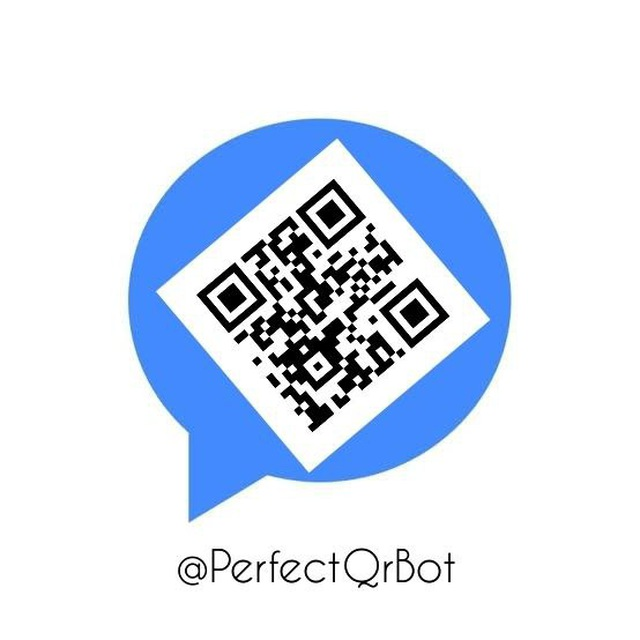
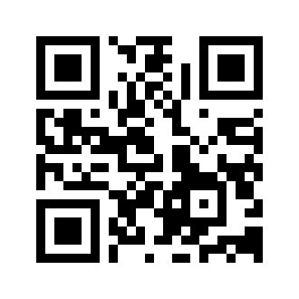

# [**Perfect Qr Bot**](https://t.me/perfectqrbot) (Version 2.0.0)

#### Powered By Codesperfect.com

---



 - PerfectQrBot is the telegram bot which give you exact qr code for any text with advanced specifications


## **Get Started**
- [Requirements](#requirements)
- [Installation](#instalation)
- [Running Bot](#running-bot)
- [Telegram BOT](#telegram-bot)
- [Modifications](#modifications)
- [Developers Point](#developers-point)
- [License](#license)
  

### **Requirements**
---
 - Python - Language
 - PyTelegramBotAPI - Python Package
 - Sqlite3 - Python Package
 - Matplotlib - Python Package
 - Qrcode -Python Package

### **Instalation**
---
Run this command in terminal to install requirements. 
```
pip install -r requirements.txt
```
### **Make changes**
---

- Open main.py file.
- Perform following operation
- You should enter your bot token in main.py(25th line)
```
token = "<BOT - TOKEN>" # Place Your Bot Token Here
```
<p align=center>(To)</p>

```
token = "3459443984:Aiudhwefihe328498kjnkjs" # Bot Token LIKE THIS
```
- Get your Telegram Bot Token from [@botfather](https://t.me/botfather)

### **Running Bot**
---
Perform those commands to run Bot. 
`Before run this command You must place your Telegram Bot Token in main.py.  `
```cmd
cd perfectqrbot
```
```
python main.py
```

## **TeleGram Bot**
---

- [Commands](#commands)
- [Buttons](#buttons)

### **Commands**
 - /start - To start bot

### **Buttons**
- 👤 DashBoard - To show Your Data.
- 🎨 Color - To change the color of QRcode.
- 🧩 Background-To change th background color of QRcode.
- 🆚 Version - To change The Version of the QRcode.
- 🖼 Border - To change The Border of the QRcode
- 🏭 Reset - To Reset all modification like changing color,background etc..
- 🐞 Report Bug - If you have any problem with PerfectQrBot report Bug at `praveen@codesperfect.com`

## **Modifications**
- 🎨 [Color](#color)
- 🧩 [Background](#background)
- 🆚 [Version](#version)
- 🖼 [Border](#border)
- 🏭 [Reset](#reset)

### **Color**
Changing color of Qr code using "🎨 Color" Button in [PerfectQrBot]("https://t.me//perfectqrbot")
- Always Choose Brighter Color
- ` Eg : ` blue,green,black,yellow

- For Example See the following snippet 

```
Changing color to Blue
```


### **Background**
Changing Background color of Qr code using "🧩 Background" Button in [PerfectQrBot]("https://t.me//perfectqrbot")

- Always Choose Less Brighter Color

- ` Eg : ` grey,pink 

- For Example See the following snippet 


 ```
 Changing Background color to Pink
 ```
 


### **Version**
Changing Version of Qr code using "🆚 Version" Button in [PerfectQrBot](https://t.me//perfectqrbot).

- Qr code version only available between 1 to 40.
- Choose number from 1 to 40 to change version of QRcode.
- Higher version may take time to scan.
- For Example See the following snippet.

```
Changing Version to 10
```


### **Border**
Changing Version of Qr code using "🖼 Border" Button in [PerfectQrBot](https://t.me//perfectqrbot).

- You can change Border from 1 to 200
- Choose number from 1 to 200 to change Border of QRcode.
- Higher number may take time to ready.
- For Example See the following snippet.

```
Changing Version to 20
```


### **Reset**
Reseting modification using "🏭 Reset" Button in [PerfectQrBot](https://t.me//perfectqrbot).

- Everything will be reset after you pressed this Button.
- color,background,version,border = black,white,1,4.
- For example see the following snippet.

```
Perform Reset option
```



---

<br>

# **Developers Point :** 
  - Source code availabel in main.py
  - Please read commented text in main file.
  - you can make changes for your convenience.
  - you should enter your bot token in main.py(25th line)
  - you can contact me at praveen@codesperfect.com for any doubts
  - Thank you Happy coding.

# **License**
Copyright (c) 2021 Praveen and team.

Permission is hereby granted, free of charge, to any person obtaining
a copy of this software and associated documentation files (the
"Software"), to deal in the Software without restriction, including
without limitation the rights to use, copy, modify, merge, publish,
distribute, sublicense, and/or sell copies of the Software, and to
permit persons to whom the Software is furnished to do so, subject to
the following conditions:

The above copyright notice and this permission notice shall be
included in all copies or substantial portions of the Software.

THE SOFTWARE IS PROVIDED "AS IS", WITHOUT WARRANTY OF ANY KIND,
EXPRESS OR IMPLIED, INCLUDING BUT NOT LIMITED TO THE WARRANTIES OF
MERCHANTABILITY, FITNESS FOR A PARTICULAR PURPOSE AND
NONINFRINGEMENT. IN NO EVENT SHALL THE AUTHORS OR COPYRIGHT HOLDERS BE
LIABLE FOR ANY CLAIM, DAMAGES OR OTHER LIABILITY, WHETHER IN AN ACTION
OF CONTRACT, TORT OR OTHERWISE, ARISING FROM, OUT OF OR IN CONNECTION
WITH THE SOFTWARE OR THE USE OR OTHER DEALINGS IN THE SOFTWARE.

---

# **Thank You 😊**
